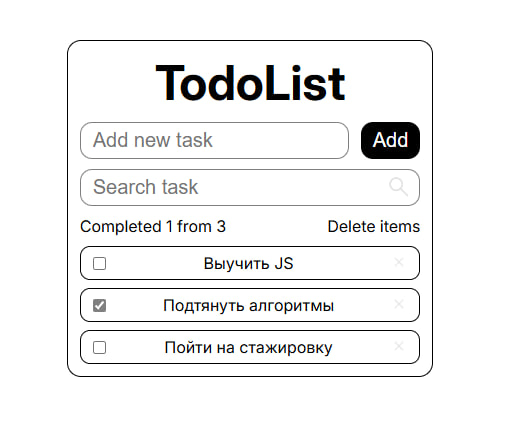

# TodoList

Минималистичное React-приложение для управления задачами с возможностью добавления, удаления, поиска и сохранения задач в `localStorage`.

---

## Скриншот



## О проекте

**TodoList** — это учебный проект на React, в котором реализован удобный и аккуратный интерфейс для работы со списком задач.

Приложение позволяет:

- добавлять новые задачи
- удалять отдельные задачи
- удалять все задачи сразу
- отмечать задачи как выполненные
- искать задачи по названию
- автоматически сохранять задачи в `localStorage`

Проект выполнен в минималистичном стиле с приятными hover-эффектами и простым, понятным интерфейсом.

---

## Функциональность

### Добавление задач
Пользователь может ввести текст новой задачи в поле ввода и добавить её в список.

### Удаление задач
Каждую задачу можно удалить по отдельности.  
Также есть возможность удалить сразу весь список задач.

### Изменение статуса задачи
Каждую задачу можно отметить как выполненную с помощью checkbox.

### Поиск задач
Реализован поиск задач по названию.  
Если поле поиска пустое — отображаются все задачи.  
Если совпадений нет — список просто становится пустым.

### Сохранение задач
Список задач автоматически сохраняется в `localStorage`, поэтому после перезагрузки страницы данные не пропадают.

### Стартовые задачи
Если в `localStorage` ещё нет сохранённых данных, приложение загружает стартовый список задач по умолчанию.

---

## Особенности интерфейса

- минималистичный дизайн
- аккуратная структура приложения
- hover-эффекты для интерактивных элементов
- приятный внешний вид без перегруженности
- простая и понятная логика взаимодействия

---

## Используемые технологии

- **React**
- **JavaScript**
- **CSS**
- **Vite**
- **localStorage**

---

## Структура проекта

```text
src/
├── assets/
│   └── icons/
├── components/
│   ├── AddTaskForm/
│   ├── Field/
│   ├── SearchTaskForm/
│   ├── TodoInfo/
│   ├── TodoList/
│   └── TodoTask/
├── App.jsx
├── main.jsx
└── index.css
```
---
## Установка и запуск

Для запуска проекта локально выполните следующие шаги.

### 1. Клонирование репозитория

```bash
git clone https://github.com/your-username/your-repository-name.git
```

### 2. Переход в папку проекта

```bash
cd your-repository-name
```
### 3. Установка зависимостей
```bash
npm install
```
### 4. Запуск проекта
```bash
npm run dev
```
После запуска в терминале появится локальный адрес, например:
```bash
http://localhost:5173
```

